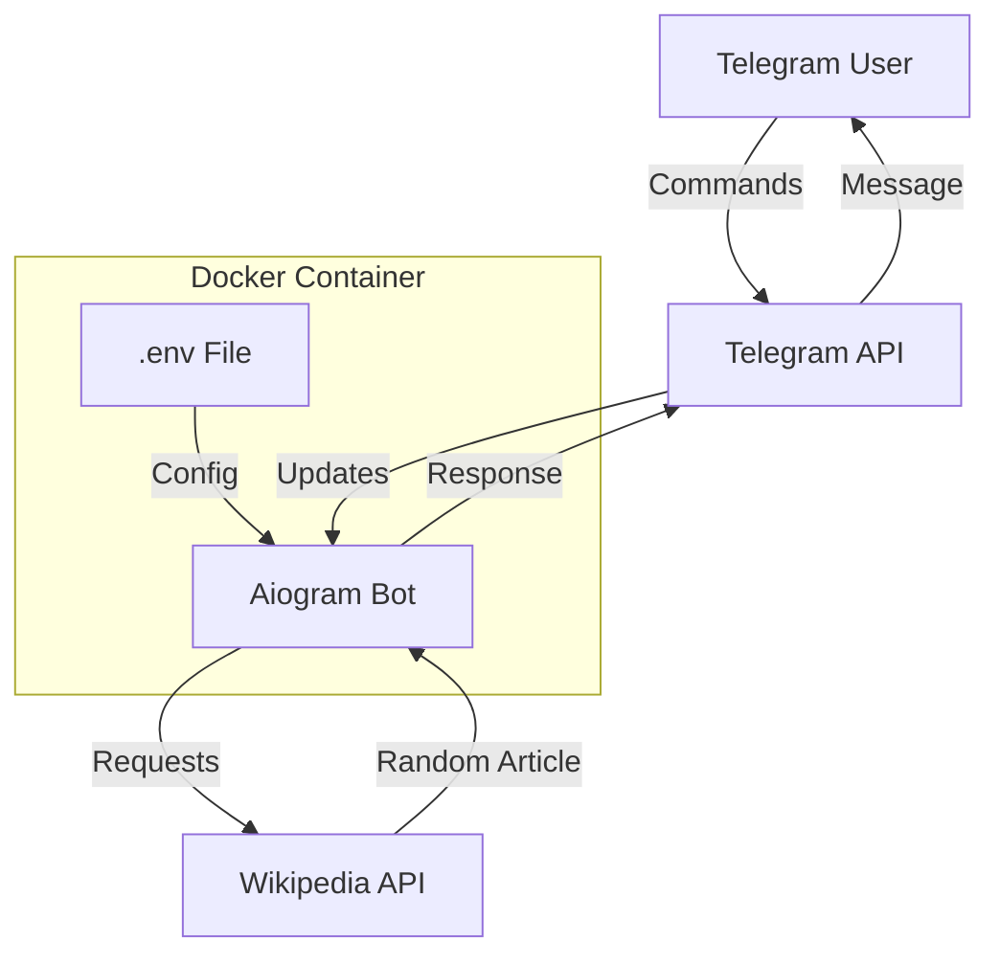

# Design Document

## Overview

Телеграм-бот построен на основе библиотеки aiogram 3.x для асинхронного взаимодействия с Telegram Bot API. Бот использует Wikipedia API для получения случайных статей на различных языках. Конфигурация осуществляется через переменные окружения, что обеспечивает гибкость развертывания. Приложение упаковано в минимальный Docker-образ на базе Python Alpine для оптимизации размера.

## Architecture



### Компоненты системы:

1. **Bot Handler Layer**: Обработчики команд и сообщений пользователей
2. **Wikipedia Service Layer**: Сервис для взаимодействия с Wikipedia API
3. **Configuration Layer**: Загрузка и валидация конфигурации из .env
4. **State Management**: Хранение выбранного языка пользователя

## Components and Interfaces

### 1. Main Application (`main.py`)

Точка входа приложения:
- Инициализация бота и диспетчера
- Загрузка конфигурации
- Регистрация обработчиков
- Запуск polling

```python
async def main():
    # Load config
    # Initialize bot and dispatcher
    # Register handlers
    # Start polling
```

### 2. Configuration Module (`config.py`)

Управление конфигурацией:

```python
class Config:
    bot_token: str
    available_languages: list[str]
    
    @classmethod
    def from_env() -> Config:
        # Load from environment variables
```

Переменные окружения:
- `BOT_TOKEN`: Токен Telegram бота
- `AVAILABLE_LANGUAGES`: Список языков через запятую (например: "ru,en,de,fr")

### 3. Wikipedia Service (`services/wikipedia.py`)

Взаимодействие с Wikipedia API:

```python
class WikipediaService:
    async def get_random_article(language: str) -> str:
        # Returns URL to random Wikipedia article
        # Uses: https://{language}.wikipedia.org/api/rest_v1/page/random/summary
```

API endpoint: `https://{lang}.wikipedia.org/api/rest_v1/page/random/summary`

### 4. Handlers Module (`handlers/`)

#### Command Handlers (`handlers/commands.py`)

- `/start`: Приветственное сообщение
- `/help`: Список команд
- `/random`: Получить случайную статью
- `/language`: Выбор языка

#### Callback Handlers (`handlers/callbacks.py`)

- Обработка выбора языка через inline-кнопки

### 5. State Management (`states.py`)

Использование FSM (Finite State Machine) для хранения выбранного языка:

```python
class UserState(StatesGroup):
    language = State()
```

## Data Models

### User Session Data

```python
{
    "user_id": int,
    "selected_language": str,  # Default: first from AVAILABLE_LANGUAGES
    "last_request_time": datetime
}
```

### Wikipedia API Response

```python
{
    "type": "standard",
    "title": str,
    "content_urls": {
        "desktop": {
            "page": str  # URL статьи
        }
    }
}
```

## Error Handling

### 1. Configuration Errors

- Отсутствие `BOT_TOKEN`: Логирование критической ошибки и выход
- Отсутствие `AVAILABLE_LANGUAGES`: Использование значения по умолчанию ["en"]
- Некорректный формат языков: Логирование предупреждения и фильтрация

### 2. Wikipedia API Errors

- Timeout (>5 секунд): Сообщение пользователю "Не удалось получить статью, попробуйте позже"
- HTTP ошибки (4xx, 5xx): Логирование и сообщение пользователю
- Некорректный язык: Сообщение "Язык не поддерживается"

### 3. Telegram API Errors

- Network errors: Автоматический retry через aiogram
- Rate limiting: Обработка через aiogram middleware

## Testing Strategy

### Unit Tests

- `test_config.py`: Валидация загрузки конфигурации
- `test_wikipedia_service.py`: Тестирование запросов к Wikipedia API (с моками)

### Integration Tests

- `test_handlers.py`: Тестирование обработчиков команд с aiogram test utilities

### Manual Testing

- Проверка работы бота в реальном Telegram
- Тестирование различных языков
- Проверка обработки ошибок

## Docker Configuration

### Dockerfile

```dockerfile
FROM python:3.11-alpine

WORKDIR /app

# Install dependencies
COPY requirements.txt .
RUN pip install --no-cache-dir -r requirements.txt

# Copy application
COPY . .

# Run bot
CMD ["python", "main.py"]
```

### docker-compose.yml

```yaml
version: '3.8'

services:
  bot:
    build: .
    env_file:
      - .env
    restart: unless-stopped
```

### Оптимизация размера образа:

- Использование `python:3.11-alpine` (базовый размер ~50MB)
- Флаг `--no-cache-dir` для pip
- Минимальный набор зависимостей
- Ожидаемый размер итогового образа: 70-90 MB

## Dependencies

```
aiogram==3.x
aiohttp==3.x
python-dotenv==1.x
```

## Project Structure

```
wikipedia-telegram-bot/
├── .env.example
├── .gitignore
├── Dockerfile
├── docker-compose.yml
├── requirements.txt
├── main.py
├── config.py
├── states.py
├── services/
│   ├── __init__.py
│   └── wikipedia.py
├── handlers/
│   ├── __init__.py
│   ├── commands.py
│   └── callbacks.py
└── tests/
    ├── __init__.py
    ├── test_config.py
    ├── test_wikipedia_service.py
    └── test_handlers.py
```
